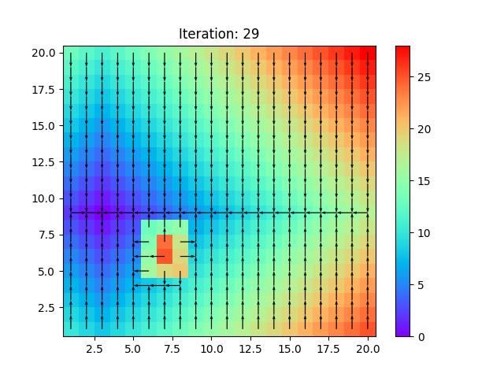

# Dynamic Programming
In this repository, dynamic programming is implemented to solve various problems.

## Install
A python virtual environment could be generated

`
python -m venv env
`

and activates in windows

`
.\env\Scripts\activate
`

in Linux

`
source ./env/bin/activate
`

## Pit of Death Example
There is a grid of squares and the agent should avoid the obstacle to reach to the goal. In the following figure, the outcome of the algorithm could be seen:
